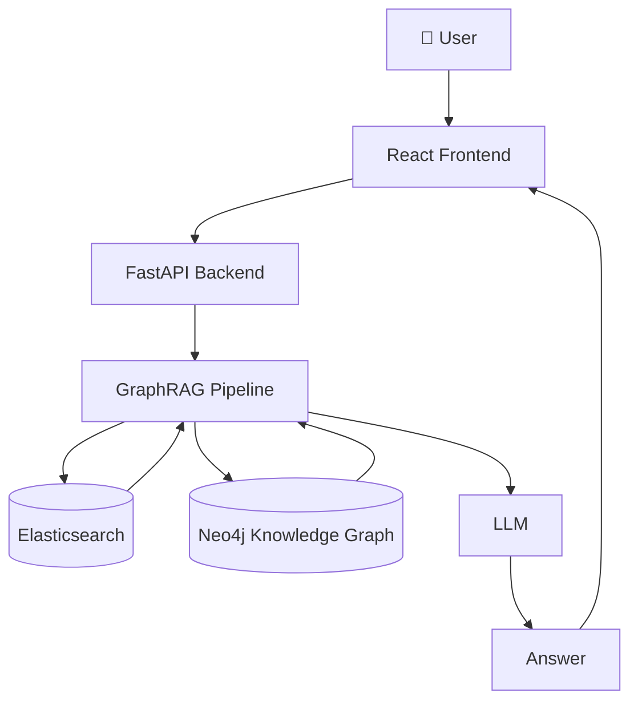

<div align="center">


**지식그래프가 제공하는 풍부한 컨텍스트를 통해 논문을 더 깊이 이해하도록 돕는 AI 논문 분석 서비스**

[](https://python.org)
[](https://fastapi.tiangolo.com)
[](https://github.com/langchain-ai/langchain)
[](https://react.dev)
[](https://vite.dev)
[](https://elastic.co)
[](https://neo4j.com)
[](https://docker.com)
[](LICENSE)


</div>

### 📖 Introduction

논문을 이해하는 것은 하나의 문서를 읽는 것으로 끝나지 않습니다. 연구자는 선행 연구를 확인하고, 관련 연구를 비교하며, 후속 연구를 탐색하는 과정을 통해 비로소 연구의 전체 맥락을 이해합니다.

기존 AI 논문 리딩 서비스인 **Moonlight**는 논문의 내용을 쉽게 이해하도록 돕지만, 개별 논문에 초점을 맞추고 있어 해당 논문을 깊이 이해하는 데 필요한 관련 연구의 배경지식과 연구 맥락을 함께 제공하기에는 한계가 있습니다.

특히 연구자가 궁금해하는 질문은 의미적으로 유사한 논문을 검색하는 것만으로 해결되지 않는 경우가 많습니다. *"이 논문은 기존 연구와 무엇이 다른가?"*, *"이 논문의 한계를 해결한 후속 연구는 무엇인가?"*, *"이 연구는 어떤 연구 흐름 속에서 등장했는가?"*와 같은 질문에 답하려면 개별 논문의 내용뿐 아니라 **논문 간의 인용 관계와 연구 흐름을 함께 이해**해야 합니다. 즉, **논문 간 관계를 연결하여 하나의 문맥으로 탐색할 수 있는 구조**가 필요합니다.

**LinkPaper**는 이러한 문제를 해결하기 위해 논문을 깊이 이해하는 데 필요한 관련 연구의 배경지식까지 함께 탐색할 수 있는 환경을 제공합니다. 이를 위해 논문, 저자, 키워드, 인용 관계를 **지식그래프**로 구축하고, **GraphRAG**를 활용하여 그래프 탐색과 의미 기반 검색을 통해 논문에 대한 입체적인 이해를 제공합니다.

궁극적으로 LinkPaper는 단순한 논문 챗봇을 넘어, 논문 간의 연결 관계를 바탕으로 연구의 맥락 속에서 논문을 이해하도록 돕는 서비스를 지향합니다.

---

### ✨ Key Features

#### 💬 Paper Q&A
선택한 논문의 내용을 기반으로 질의응답을 제공하여 논문의 복잡한 개념과 세부 내용을 이해할 수 있습니다.

#### 🌐 GraphRAG-based Research Q&A
관련 논문과 인용 관계가 저장된 지식그래프 기반 GraphRAG를 활용하여, 현재 논문을 더 깊이 이해할 수 있는 심층 질의응답을 제공합니다.

#### 🧭 Research Flow Exploration
선행 연구, 후속 연구, 관련 논문의 연결 관계를 탐색하며 하나의 논문이 연구 분야에서 어떤 위치와 의미를 가지는지 이해할 수 있습니다.
> 💡 **예시 질문**
> - 이 논문에 소개된 ~라는 개념을 다른 논문에선 어떻게 설명하고 있지?
> - 이 논문의 한계를 해결한 후속 연구는 무엇인가?
> - 이 연구는 어떤 연구 흐름 속에서 등장했는가?

---

### 🎬 Demo

> 🚧 Coming Soon

#### Demo Contents

- 🔍 Hugging Face Papers에 등록된 논문 검색
- 📄 논문 기반 AI 챗봇
- 🌐 GraphRAG가 제공하는 컨텍스트 기반 심층 질의응답

---

### 🏗️ Architecture

> 🚧 Coming Soon



---

### 📂 Project Structure

```text
linkpaper/

├── backend/
│   ├── api/
│   ├── graph/
│   ├── retrieval/
│   ├── llm/
│   └── app/
│
├── frontend/
│   ├── src/
│   └── public/
│
├── docs/
│   ├── images/
│   ├── architecture.md
│   ├── graph-schema.md
│   ├── evaluation.md
│   └── api.md
│
├── docker/
│
├── scripts/
│
└── README.md
```

---

### 🚀 Usage

> **Requirements**: Docker Engine 20.10+ / Docker Compose V2 · 메모리 8GB 이상

```bash
git clone https://github.com/linkmind-ai/linkpaper.git

cd linkpaper

cp .env.example .env
# .env에 OPENAI_API_KEY 등 필요한 키를 채워주세요

docker compose up -d
```

실행 후 http://localhost:5173 에서 확인할 수 있습니다.

---

### 👥 Team

| 이름 | 역할 | 담당 업무 |
|------|------|-----------|
| 정상헌 | PM / Data | 프로젝트 관리, 요구사항 정의, 데이터 수집 및 전처리 |
| 김대건 | Backend / GraphRAG | GraphRAG 파이프라인 및 FastAPI 개발 |
| 김수용 | Evaluation | GraphRAG 평가 및 벤치마크 구축 |
| 남두현 | Graph DB | 지식 그래프 구축 및 벡터 인덱싱 |
| 오창원 | Frontend | 프론트엔드 개발 및 백엔드 연동 |
| 홍예린 | Infrastructure | Docker, 모델 서빙 및 인프라 운영 |

---

### 📚 References

#### Papers

- Lewis et al., *Retrieval-Augmented Generation for Knowledge-Intensive NLP Tasks* (2020)
- Microsoft Research, *From Local to Global: A GraphRAG Approach to Query-Focused Summarization* (2024)

#### Related Services

- [Moonlight](https://www.themoonlight.io/ko) — AI 기반 논문 요약 및 리딩 서비스
- [AlphaXIV-Open](https://github.com/AsyncFuncAI/alphaxiv-open) — arXiv 논문에 대한 AI 질의응답을 GraphRAG 기반으로 제공하는 오픈소스

---

### 🤝 Contributing

Issue와 Pull Request는 언제든지 환영합니다.

기능 추가나 큰 변경 사항은 먼저 Issue를 통해 논의한 후 진행해 주세요.