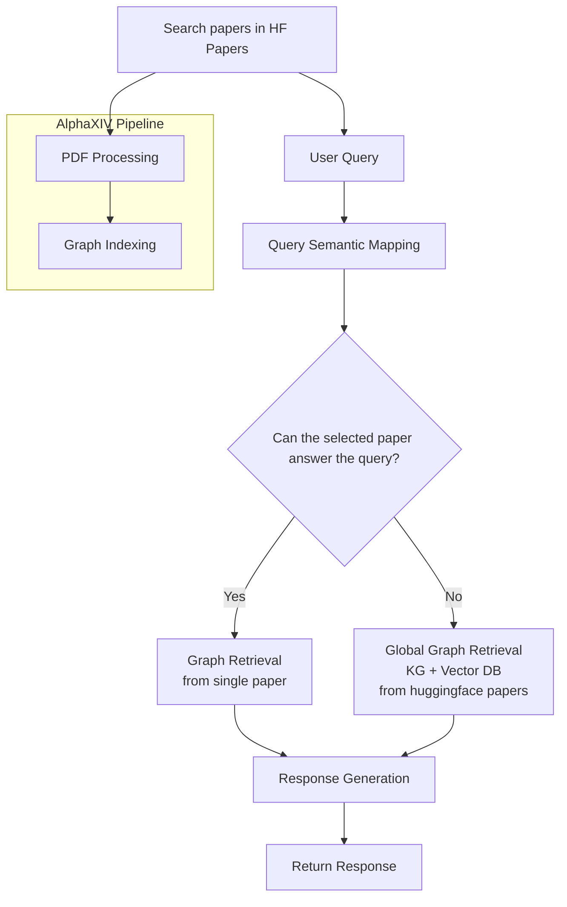

# 📋 Project Specification

### Base Project : AlphaXIV-Open
URL : https://github.com/AsyncFuncAI/alphaxiv-open/tree/main

## Goal

기존 AlphaXIV-Open은 사용자가 입력한 **단일 arXiv 논문**을 대상으로 문서를 처리하고, 해당 논문으로부터 Knowledge Graph를 구축하여 질의응답을 수행한다.

반면 LinkPaper는 **사용자가 arXiv URL을 입력하는 대신 Hugging Face Papers에서 논문을 검색하여 선택**하고, 선택한 논문를 동일한 방식으로 처리하는 동시에 **Hugging Face Papers 전체 논문을 기반으로 구축한 Knowledge Graph**를 함께 활용한다.

이를 통해 선택한 논문의 내용뿐만 아니라 관련 논문 간의 인용 관계와 연구 흐름까지 함께 탐색할 수 있는 GraphRAG 서비스를 제공하는 것을 목표로 한다.

프로토타입에서는 AlphaXIV-Open의 기존 문서 처리 및 GraphRAG 기반 질의응답 파이프라인을 최대한 재사용하면서, **전체 논문 기반 Knowledge Graph를 활용한 Retrieval과 관련 논문 탐색 기능**을 중심으로 서비스를 확장한다.

---

## User Flow

---

## Functional Requirements

### Hugging Face Papers에 등록된 논문 검색

AlphaXIV-Open에서는 사용자가 arXiv URL을 직접 입력하지만, LinkPaper에서는 Hugging Face Papers에서 논문를 검색하는 방식으로 이를 대체한다. 검색된 논문를 입력으로 받아 이후 PDF Processing 파이프라인을 자동으로 수행한다.

**구현 범위**

- Hugging Face Papers API 연동
- 논문 검색 기능
- 검색된 논문를 입력으로 PDF Processing 파이프라인 자동 실행

### HuggingFace Papers 지식그래프 구축

HuggingFace Papers에 등록된 전체 논문를 처리하여 GraphRAG에서 활용할 Knowledge Graph를 구축한다. API에서 수집한 메타데이터와 PDF에서 추출한 인용 관계 및 논문 세부 내용을 통합하여 하나의 Knowledge Graph를 생성하고 지속적으로 갱신한다.

**구현 범위**

- Hugging Face Papers API 기반 논문 데이터 수집
- API에서 논문 메타데이터를 수집하고, PDF 본문에서 Citation, Entity 등 관계 정보를 추출
- 메타데이터, Citation, Entity를 통합한 지식그래프 구축 및 갱신

### GraphRAG

사용자 질의를 분석하여 선택한 논문만으로 답변이 가능한 경우에는 AlphaXIV-Open과 동일한 파이프라인을 수행한다. 선택한 논문만으로 충분한 답변을 생성할 수 없는 경우에는 HuggingFace Papers 기반 Knowledge Graph를 활용한 GraphRAG 파이프라인을 수행하여 관련 논문까지 함께 검색하고 답변을 생성한다.

**구현 범위**

- 사용자 질의를 분석해서 선택한 논문만으로 답변 가능한지 판단
- 검색한 논문 기반 Retrieval 및 질의응답 (AlphaXIV-Open 파이프라인)
- HuggingFace Papers Knowledge Graph 기반 GraphRAG 파이프라인으로 조건부 라우팅
    → 관련 논문을 포함한 GraphRAG 기반 질의응답

### Future Features (Optional)

- 논문 요약
- 선택한 텍스트 번역
- 선택한 텍스트 / 이미지 AI 설명

---
