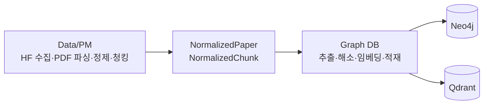
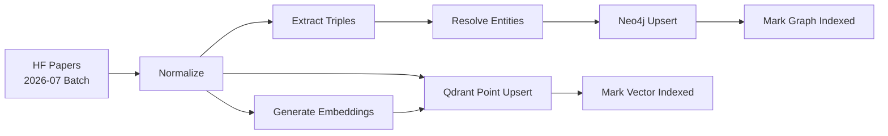
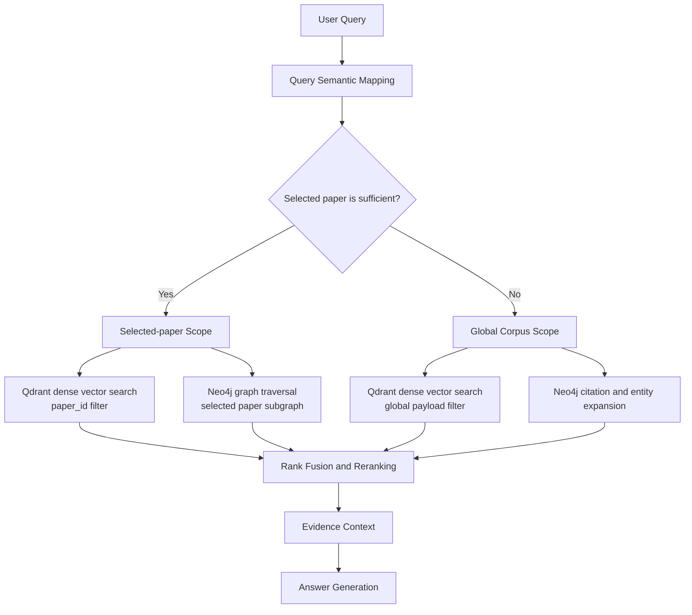

# LinkPaper Data & Retrieval Architecture

## 1. 목적

LinkPaper는 사용자가 선택한 논문의 내용만으로 답변할 수 있으면 해당 논문을
대상으로 검색하고, 부족하면 사전에 구축한 Hugging Face Papers 글로벌
지식그래프로 검색 범위를 확장한다.
> 오프라인 `indexing/` 엔진은 데이터를
주기적으로 전처리·적재한다.

> 온라인 `backend/`는 완료된 인덱스만 읽는다.
MVP 글로벌 코퍼스는 2026년 7월 Hugging Face Papers에 등록된 논문으로
구성하며, 이후 Month 단위 배치를 추가하여 전체 코퍼스로 확장한다.


상세 Neo4j 모델은 [Neo4j Graph Schema](./neo4j-schema.md)를 참고한다.
제품 수준 요구사항은 [Project Specification](../PROJECT_SPEC.md)을 기준으로 한다.

## 2. 아키텍처 결정 요약

| 구성 요소 | 책임 |
|---|---|
| `indexing/` | 주기적인 수집·전처리·추출·임베딩과 저장소 write |
| `backend/` | 사용자 요청, Qdrant·Neo4j read, 검색 결과 결합과 답변 생성 |
| Qdrant | 청크 임베딩, 벡터 유사도 검색, `paperId`·글로벌 범위 기반 payload 필터 |
| Neo4j | 논문·저자·청크·엔티티 노드, 인용 및 의미 관계, Cypher 그래프 탐색 |
| LangGraph/LangChain | 답변 가능 여부 판단, 검색 도구 선택, 검색 결과 결합·재정렬, 답변 생성 |
| 정규화 데이터 | Qdrant와 Neo4j를 재구축할 수 있는 공통 입력 |

핵심 결정은 다음과 같다.

1. 벡터와 임베딩 메타데이터의 저장소는 Qdrant.
2. GraphDB는 Neo4j이며 Neo4j에는 임베딩이나 벡터 인덱스를 만들지 않는다.
3. Qdrant와 Neo4j는 `paperId`, `chunkId` 값을 공유하며 엔티티 ID는 Neo4j에서 관리한다.
4. 선택 논문과 글로벌 코퍼스는 별도 컬렉션이나 DB로 복제하지 않고 payload와
   보조 라벨로 범위를 구분한다.
5. Qdrant 검색 결과의 `chunkId`를 Neo4j 그래프 확장의 시작점으로 사용한다.
6. 벡터 순위와 그래프 확장 결과는 LangGraph 검색 계층에서 결합한다.
7. MVP의 필수 임베딩 단위는 `Chunk`이며 `Paper` 임베딩은 선택 사항이다.
8. `indexing/`은 스케줄에 따라 실행되는 오프라인 프로세스이며 Neo4j와
   Qdrant의 write를 담당한다.
9. `backend/`는 사용자 요청을 처리하는 온라인 프로세스이며 Neo4j와 Qdrant의 검색을 담당한다.
10. `backend/`에 CRUD 메서드 골격이 존재하더라도 온라인 사용자 요청에서는
    Neo4j와 Qdrant의 조회만 수행한다.
11. 실제 create·update·delete와 배치 적재는 `indexing/`에서만 수행한다.

## 3. 전체 구성

```mermaid
flowchart LR
    subgraph Sources[Data Sources]
        HF[Hugging Face Papers<br/>2026-07 Month]
        PDF[Paper PDF]
    end

    subgraph Offline[Offline Indexing - indexing/]
        PARSE[Parse and Clean]
        SPLIT[Section-aware Chunking]
        NORMAL[Normalized Paper]
        ER[Entity and Relation Extraction]
        RESOLVE[Entity Resolution]
        EMBED[Qwen3 Chunk<br/>Embedding Generation] *Qwen3 선택사항
    end

    subgraph Stores[Serving Stores]
        QDR[(Qdrant<br/>Vector Search)]
        NEO[(Neo4j<br/>Knowledge Graph)]
    end

    subgraph Online[Online Serving - backend/]
        USER[User Request]
        AGENT[LangGraph]
        LLM[Answer Generation]
    end

    HF --> PARSE
    PDF --> PARSE
    PARSE --> SPLIT
    SPLIT --> NORMAL
    NORMAL --> ER
    ER --> RESOLVE
    NORMAL --> EMBED
    RESOLVE --> NEO
    NORMAL --> QDR
    EMBED --> QDR
    USER --> AGENT
    QDR --> AGENT
    NEO --> AGENT
    AGENT --> LLM
```

## 4. 공통 데이터 모델

전처리 단계는 특정 저장소 형식에 종속되지 않은 정규화 결과를 생성한다.
전달 형식은 JSON이며 `NormalizedPaper` 한 건 안에 저자, 참고문헌과 청크 배열을
포함한다. 다음 기본 정보를 포함한다.

### 4.1 NormalizedPaper

```text
paperId
arxivId
title
abstract
authors[]
publishedAt
sourceUrl
pdfUrl
references[]
chunks[]
contentHash
sourceVersion
```

### 4.2 NormalizedChunk

```text
chunkId
paperId
chunkIndex
text
section
charCount
contentHash
```

이 정규화 결과가 재처리의 기준이다. Neo4j나 Qdrant에서 다른 저장소를
직접 복제하지 않는다.

전달 JSON에서는 각각 `source_version`, `published_at`, `char_count`로
직렬화한다. `source_version`은 `hf-markdown` 또는 `pdf-pymupdf4llm`이다.

### 4.3 전달 계약 및 구현 책임

`NormalizedPaper`와 `NormalizedChunk`는 데이터 파이프라인의 출력이자 그래프
빌더의 입력 계약이다. 데이터 파이프라인이 PDF 파싱과 청킹을 완료하므로 그래프
빌더는 원문을 다시 파싱하거나 청킹하지 않는다.

모든 오프라인 구현은 [`indexing/`](../../indexing/README.md)에 둔다. Qdrant
작업 코드는 `indexing/vector_builder/`, Neo4j 작업 코드는 `indexing/graph_builder/`가
소유한다. 데이터 처리 코드를 포함한 나머지 오프라인 단계도 `indexing/`에
배치한다. 온라인 `backend/`와 공유하는 것은 Python 구현이 아니라
ID·저장 스키마·인덱스 버전이다.



| 단계 | 담당 | 출력 또는 책임 |
|---|---|---|
| 데이터 파이프라인 | Data/PM | HF Month 수집, PDF 파싱·정제·섹션 보존 청킹, 정규화 데이터 생성 |
| 데이터 계약 | Data/PM·Graph DB | 필수 필드, ID, 해시, 버전과 전달 형식 합의 |
| 그래프 빌더 | Graph DB | 입력 검증, 엔티티·Triple 추출, 엔티티 해소, 임베딩 생성 |
| 저장소 적재 | Graph DB | Neo4j idempotent upsert, Qdrant batch upsert |
| 검색·답변 | Backend/GraphRAG | 완료된 인덱스의 read, 검색 범위 결정, 결과 융합과 답변 생성 |

데이터 파이프라인은 저자와 참고문헌의 원시·식별 정보를 제공한다. 그래프 빌더는
저자 ID와 인용 대상 논문을 정규화하고 `AUTHORED_BY`, `CITES` 관계를 생성한다.
엔티티, Triple, 임베딩과 저장소별 인덱스 구조는 정규화 입력에 포함하지 않는다.

## 5. 적재 흐름

`indexing/`의 오프라인 오케스트레이션 계층이 데이터 처리와 그래프 빌더를
주기적으로 순서대로 호출한다. `backend/`의 온라인 요청 경로에서는 이 적재
흐름을 실행하지 않는다.

### 5.1 주기적 글로벌 코퍼스 구축

MVP에서는 2026년 7월 Hugging Face Papers 논문을 글로벌 코퍼스로 사용한다.
적재는 논문 단위로 checkpoint를 기록하는 배치로 실행하며,
이후 다른 Month를 같은 방식으로 추가하여 전체 코퍼스로 확장한다.



글로벌 논문에는 Neo4j에서 `:GlobalPaper`, 해당 청크에는
`:GlobalChunk` 보조 라벨을 부여한다. Qdrant point payload에는
`in_global_corpus=true`를 기록한다.

### 5.2 선택 논문의 온라인 조회

사용자가 Hugging Face Papers 검색 결과에서 논문을 선택하면 `backend/`는
다음 순서로 이미 완성된 인덱스를 조회한다.

1. `paperId`로 현재 서비스 중인 인덱스 버전의 적재 여부를 확인한다.
2. Qdrant에서 `paper_id` payload filter로 선택 논문의 청크를 검색한다.
3. Qdrant 결과의 `chunk_id`를 이용해 Neo4j 그래프를 확장한다.
4. 선택 논문 결과가 부족하면 같은 인덱스 버전의 글로벌 범위로 확장한다.
5. 논문이 아직 적재되지 않았더라도 온라인 요청에서 파싱·임베딩·write를
   실행하지 않는다. 미적재 논문의 사용자 노출 정책은 API 계약에서 정한다.

## 6. 검색 흐름



### 6.1 선택 논문 검색

선택 논문은 `paperId`로 범위를 먼저 제한한다.

- Qdrant: `paper_id` payload filter + dense vector search
- Neo4j: 해당 논문의 청크, 엔티티, 인용 논문만 그래프 탐색

선택 논문과 글로벌 코퍼스는 같은 Qdrant 컬렉션을 사용하며 payload filter로
검색 범위를 제한한다.

### 6.2 글로벌 검색

- Qdrant: `in_global_corpus=true` payload filter + dense vector search
- Neo4j: Qdrant가 반환한 `chunk_id`를 시작점으로 엔티티와 인용 관계를 확장
- LangGraph: 각 검색기의 순위를 결합하고 필요하면 reranker를 적용

Qdrant 벡터 점수와 Neo4j 그래프 확장 신호는 척도가 다르므로 원시 점수를
직접 더하지 않고 RRF 등의 순위 기반 결합이나 reranker를 사용한다.

## 7. GraphRAG 검색 인터페이스

DB 계층은 LangGraph가 호출할 수 있는 결정적이고 제한된 검색 기능을 제공한다.

```text
search_vectors(query_embedding, scope, paper_id, filters, top_k)
expand_graph(seed_ids, relation_types, max_depth, limit)
get_evidence(chunk_ids)
```

통합 후보 결과는 최소한 다음 계약을 따른다.

```json
{
  "paperId": "arxiv:1706.03762",
  "chunkId": "arxiv:1706.03762:chunk:12:9f83a2c1",
  "text": "...",
  "scope": "selected",
  "retrievalSource": "qdrant_vector",
  "rank": 1,
  "score": 0.91,
  "section": "Experiments",
  "matchedEntityIds": ["model:bert"]
}
```

`retrievalSource`는 다음 중 하나를 사용한다.

- `qdrant_vector`
- `neo4j_graph`

## 8. 일관성 및 재처리

Neo4j와 Qdrant 사이에 분산 트랜잭션을 사용하지 않는다. 대신 공통
정규화 데이터와 결정적 ID를 이용하여 오프라인 엔진에서 안전하게 재실행한다.

1. 정규화 결과와 `contentHash`를 생성한다.
2. Neo4j 적재를 논문 단위 트랜잭션으로 실행한다.
3. Qdrant batch upsert를 실행한다.
4. 저장소별 완료 상태를 기록한다.
5. 일부 단계가 실패하면 같은 입력으로 실패한 단계만 재실행한다.

모든 write는 idempotent upsert를 사용한다.

- Neo4j: 고유 ID 기반 `MERGE`
- Qdrant: `chunkId`에서 만든 결정적 UUID를 point ID로 사용
- 내용 또는 임베딩 모델이 바뀌면 버전을 올리고 재색인

## 9. 버전 관리

다음 버전을 데이터에 기록한다.

| 버전 | 목적 |
|---|---|
| `schemaVersion` | 노드·관계 스키마 버전 |
| `sourceVersion` | 본문 확보 경로와 전처리 방식 |
| `embeddingProvider` | 임베딩 실행 주체. 초기값은 `local`, API 전환 시 `openai` |
| `embeddingModel` | 임베딩 모델 이름 |
| `embeddingDimension` | 벡터 인덱스와 일치해야 하는 임베딩 차원 |
| `embeddingVersion` | 임베딩 파라미터 및 전처리 버전 |
| `extractorModel` | 엔티티·관계 추출 모델 |
| `extractorVersion` | 프롬프트 및 추출 규칙 버전 |
| Qdrant collection suffix | 벡터·payload 스키마 버전 |
