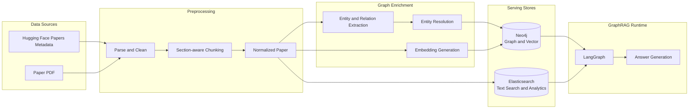
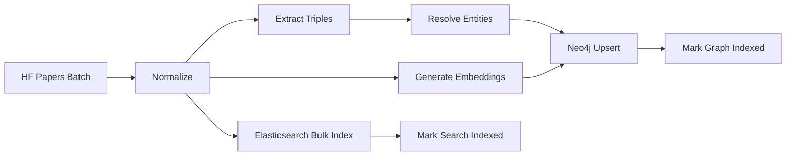
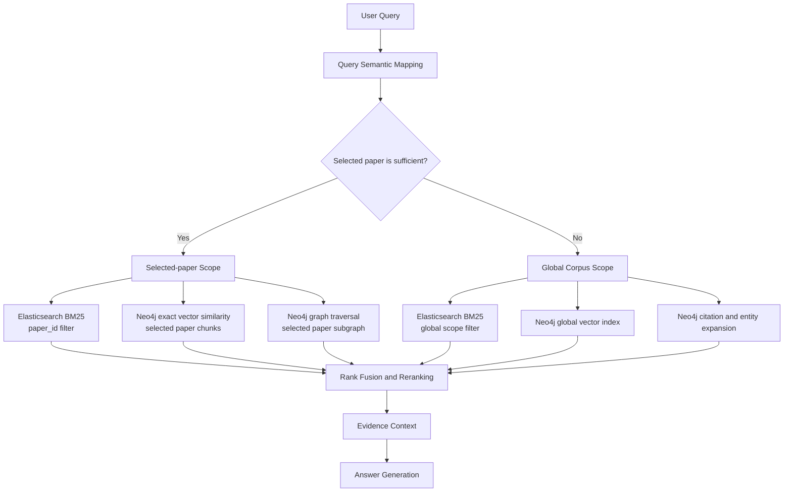

# LinkPaper Data & Retrieval Architecture

> 상태: Draft
>
> 범위: 논문 데이터 적재, Neo4j 지식그래프·벡터 검색, Elasticsearch 전문 검색, LangGraph 연동 경계

## 1. 목적

LinkPaper는 사용자가 선택한 논문의 내용만으로 답변할 수 있으면 해당 논문을
대상으로 검색하고, 부족하면 사전에 구축한 Hugging Face Papers 전체
지식그래프로 검색 범위를 확장한다.

이 문서는 다음 사항을 정의한다.

- Neo4j와 Elasticsearch의 책임
- 선택 논문과 글로벌 코퍼스의 적재 방식
- 논문 처리 및 검색 데이터 흐름
- LangGraph 기반 GraphRAG 파이프라인과의 인터페이스
- 두 저장소 사이의 식별자 및 일관성 원칙

상세 Neo4j 모델은 [Neo4j Graph Schema](./neo4j-schema.md)를 참고한다.
제품 수준 요구사항은 [Project Specification](../PROJECT_SPEC.md)을 기준으로 한다.

## 2. 아키텍처 결정 요약

| 구성 요소 | 책임 |
|---|---|
| Neo4j | 논문·저자·청크·엔티티 노드, 인용 및 의미 관계, 임베딩, 벡터 인덱스, Cypher 탐색 |
| Elasticsearch | 제목·초록·본문 전문 검색, BM25 검색, 저자·연도·키워드 필터, 패싯·집계·검색 UI |
| LangGraph/LangChain | 답변 가능 여부 판단, 검색 도구 선택, 검색 결과 결합·재정렬, 답변 생성 |
| 정규화 데이터 | Neo4j와 Elasticsearch를 재구축할 수 있는 공통 입력 |

핵심 결정은 다음과 같다.

1. 지식그래프와 임베딩의 저장소는 Neo4j다.
2. Elasticsearch는 검색을 위한 파생 인덱스이며 원본 데이터 저장소가 아니다.
3. 임베딩은 Neo4j에만 저장하고 Elasticsearch에는 중복 저장하지 않는다.
4. Neo4j와 Elasticsearch는 `paperId`, `chunkId`, `entityId`를 공유한다.
5. 선택 논문과 글로벌 코퍼스는 별도 DB로 복제하지 않고 동일한 모델에서 범위를 구분한다.
6. 두 저장소의 검색 점수는 직접 비교하지 않고 LangGraph 검색 계층에서 순위 기반으로 결합한다.

## 3. 전체 구성



## 4. 공통 데이터 모델

전처리 단계는 특정 저장소 형식에 종속되지 않은 정규화 결과를 생성한다.
구현 형식은 Pydantic 모델, JSONL 또는 Parquet 중에서 정할 수 있지만 최소한
다음 정보를 포함해야 한다.

### 4.1 NormalizedPaper

```text
paperId
arxivId
title
abstract
authors[]
publishedAt
sourceUrl
pdfUrl
references[]
chunks[]
contentHash
sourceVersion
```

### 4.2 NormalizedChunk

```text
chunkId
paperId
chunkIndex
text
section
pageStart
pageEnd
tokenCount
contentHash
```

이 정규화 결과가 재처리의 기준이다. Neo4j나 Elasticsearch에서 다른 저장소를
직접 복제하지 않는다.

## 5. 적재 흐름

하나의 적재 파이프라인을 실행 모드만 달리하여 사용한다.

### 5.1 글로벌 코퍼스 구축

프로토타입에서는 서로 연관된 Hugging Face Papers 논문 약 10편을 사용한다.
이후 동일한 파이프라인을 배치 단위로 실행하여 전체 코퍼스로 확장한다.



글로벌 논문에는 Neo4j에서 `:GlobalPaper`, 해당 청크에는
`:GlobalChunk` 보조 라벨을 부여한다. 글로벌 벡터 인덱스는
`:GlobalChunk`만 포함한다.

### 5.2 선택 논문 온디맨드 처리

사용자가 Hugging Face Papers 검색 결과에서 논문을 선택하면 다음 순서로
처리한다.

1. `paperId`로 기존 처리 여부를 확인한다.
2. 처리되지 않았다면 PDF 파싱부터 동일한 적재 파이프라인을 실행한다.
3. 이미 글로벌 코퍼스에 존재하면 기존 `Paper`와 `Chunk`를 재사용한다.
4. 글로벌 코퍼스에 포함되지 않은 논문은 `:Paper`, `:Chunk`로 저장하되
   글로벌 보조 라벨은 부여하지 않는다.
5. Elasticsearch에는 `in_global_corpus`와 `processing_status`를 포함해 색인한다.

## 6. 저장소 책임

### 6.1 Neo4j

Neo4j는 다음 데이터의 serving source다.

- 논문, 저자, 청크, 엔티티
- 논문 간 인용 관계
- 논문·청크와 엔티티의 연결
- LLM이 추출한 의미 관계와 그 근거
- 논문 및 청크 임베딩
- 글로벌 벡터 인덱스
- 선택 논문 내부 및 글로벌 그래프 탐색

Neo4j에는 원문 전체를 별도 문서처럼 중복 저장하지 않고 `Chunk.text`와
검색·근거 표시에 필요한 메타데이터만 저장한다.

### 6.2 Elasticsearch

Elasticsearch는 다음 기능을 담당한다.

- 논문 제목·초록·본문 BM25 검색
- 제목, 저자, 키워드, arXiv ID 검색
- 연도, 분야, 저자, 글로벌 포함 여부 필터
- 검색 결과 하이라이트
- 패싯 및 집계
- 프런트엔드 논문 검색

권장 인덱스는 다음 두 개다.

| 인덱스 | 문서 단위 | 주요 필드 |
|---|---|---|
| `linkpaper-papers-v1` | 논문 | `paper_id`, `title`, `abstract`, `authors`, `published_at`, `keywords`, `in_global_corpus` |
| `linkpaper-chunks-v1` | 청크 | `chunk_id`, `paper_id`, `text`, `section`, `page_start`, `page_end`, `in_global_corpus` |

인덱스 이름의 버전은 mapping 변경 시 증가시키며, 애플리케이션은 read alias를
사용하는 방식을 권장한다.

## 7. 검색 흐름



### 7.1 선택 논문 검색

선택 논문은 `paperId`로 범위를 먼저 제한한다.

- Elasticsearch: `paper_id` term filter + BM25
- Neo4j: `Paper`에서 `HAS_CHUNK`로 청크를 제한한 후 코사인 유사도 계산
- Neo4j: 해당 논문의 청크, 엔티티, 인용 논문만 그래프 탐색

현재 프로젝트의 Neo4j 5.26에서는 선택 논문별 벡터 인덱스를 만들지 않는다.
논문 하나의 청크 수는 글로벌 코퍼스보다 작으므로 범위 제한 후 exact similarity를
계산한다.

### 7.2 글로벌 검색

- Elasticsearch: `in_global_corpus=true` 필터 + BM25
- Neo4j: `GlobalChunk.embedding` 벡터 인덱스로 후보 검색
- Neo4j: 후보 논문에서 엔티티와 인용 관계를 확장
- LangGraph: 각 검색기의 순위를 결합하고 필요하면 reranker를 적용

Neo4j 벡터 점수와 Elasticsearch BM25 점수는 척도가 다르다. 원시 점수를
더하거나 직접 비교하지 않고 RRF 등의 순위 기반 결합을 사용한다.

## 8. GraphRAG 검색 인터페이스

DB 계층은 LangGraph가 호출할 수 있는 결정적이고 제한된 검색 기능을 제공한다.

```text
search_selected_paper(paper_id, query, query_embedding, top_k)
search_global_vector(query_embedding, top_k)
search_full_text(query, scope, filters, top_k)
expand_graph(seed_ids, relation_types, max_depth, limit)
get_evidence(chunk_ids)
```

통합 후보 결과는 최소한 다음 계약을 따른다.

```json
{
  "paperId": "arxiv:1706.03762",
  "chunkId": "arxiv:1706.03762:chunk:12:9f83a2c1",
  "text": "...",
  "scope": "selected",
  "retrievalSource": "neo4j_vector",
  "rank": 1,
  "score": 0.91,
  "section": "Experiments",
  "pageStart": 6,
  "matchedEntityIds": ["model:bert"]
}
```

`retrievalSource`는 다음 중 하나를 사용한다.

- `elasticsearch_bm25`
- `neo4j_vector`
- `neo4j_graph`

## 9. 일관성 및 재처리

Neo4j와 Elasticsearch 사이에 분산 트랜잭션을 사용하지 않는다. 대신 공통
정규화 데이터와 결정적 ID를 이용하여 안전하게 재실행한다.

1. 정규화 결과와 `contentHash`를 생성한다.
2. Neo4j 적재를 논문 단위 트랜잭션으로 실행한다.
3. Elasticsearch bulk indexing을 실행한다.
4. 저장소별 완료 상태를 기록한다.
5. 일부 단계가 실패하면 같은 입력으로 실패한 단계만 재실행한다.

모든 write는 idempotent upsert를 사용한다.

- Neo4j: 고유 ID 기반 `MERGE`
- Elasticsearch: `paper_id`, `chunk_id`를 document `_id`로 사용
- 내용 또는 임베딩 모델이 바뀌면 버전을 올리고 재색인

## 10. 버전 관리

다음 버전을 데이터에 기록한다.

| 버전 | 목적 |
|---|---|
| `schemaVersion` | 노드·관계 스키마 버전 |
| `sourceVersion` | 수집 및 전처리 데이터 버전 |
| `embeddingModel` | 임베딩 모델 이름 |
| `embeddingVersion` | 임베딩 파라미터 및 전처리 버전 |
| `extractorModel` | 엔티티·관계 추출 모델 |
| `extractorVersion` | 프롬프트 및 추출 규칙 버전 |
| Elasticsearch index suffix | 검색 mapping 버전 |

## 11. 보안 및 운영 원칙

- 적재 프로세스는 write 권한이 있는 별도 Neo4j 계정을 사용한다.
- LangGraph 및 생성형 Cypher 실행은 read-only 계정을 사용한다.
- 생성형 Cypher에는 timeout, result limit, 허용 라벨·관계 타입 검증을 적용한다.
- Elasticsearch도 적재 계정과 검색 전용 계정을 분리한다.
- API 키와 DB 비밀번호는 환경변수 또는 secret manager로 주입한다.
- 로그에는 원문 전체, 임베딩 벡터, 인증정보를 출력하지 않는다.

## 12. 팀 인터페이스

| 담당 영역 | 제공 또는 합의할 내용 |
|---|---|
| Data/PM | 정규화 입력 스키마, 초기 논문 선정, 데이터 전달 및 갱신 주기 |
| Graph DB | Neo4j 스키마, 트리플 추출·엔티티 정규화, 임베딩, Neo4j·Elasticsearch 적재 |
| Backend/GraphRAG | LangGraph 라우팅, 검색 도구 호출, Cypher 생성, 결과 융합 및 답변 생성 |
| Evaluation | 추출 정확도, 검색 Recall@K, 근거 충실도 평가 계약 |
| Infrastructure | Neo4j·Elasticsearch 운영, 인증, 백업, 모니터링 및 모델 서빙 |
| Frontend | 검색 필터, 그래프 표시 속성, 근거 링크 형식 |

## 13. MVP 완료 조건

- 선택 논문 1편을 온디맨드로 처리할 수 있다.
- 초기 글로벌 논문 약 10편을 동일한 파이프라인으로 적재할 수 있다.
- 재실행해도 노드, 관계, 검색 문서가 중복되지 않는다.
- Neo4j에서 논문·청크·엔티티·인용 관계를 탐색할 수 있다.
- Neo4j에서 선택 논문 exact vector 검색과 글로벌 vector index 검색이 동작한다.
- Elasticsearch에서 논문 및 청크 BM25 검색과 필터가 동작한다.
- 모든 검색 결과가 `paperId`와 `chunkId`로 원문 근거에 연결된다.
- LangGraph가 로컬·글로벌 검색 인터페이스를 호출할 수 있다.

## 14. 후속 결정 사항

- 임베딩 모델과 차원
- 청크 크기, overlap 및 섹션 보존 규칙
- 초기 엔티티·관계 allowlist
- 엔티티 정규화 및 동명이인 정책
- Elasticsearch analyzer와 한국어 질의 처리 방식
- 전체 코퍼스 갱신 주기와 배치 크기
- 검색 결과 융합 및 reranker 기준
