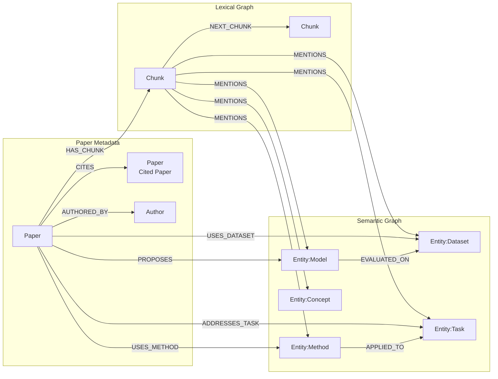

# LinkPaper Neo4j Graph Schema

> 대상 버전: Neo4j 5.26 Community


## 1. 목적

이 문서는 LinkPaper에서 사용하는 Neo4j Labeled Property Graph의 노드,
관계, 속성, 식별자, 제약조건과 벡터 인덱스를 정의한다.

이 스키마는 두 검색 범위를 함께 지원한다.

- 선택 논문 범위: 사용자가 선택한 논문의 청크와 엔티티만 검색
- 글로벌 범위: 사전에 구축한 Hugging Face Papers 코퍼스 전체 검색

두 범위는 별도 데이터베이스로 복제하지 않는다. 동일 `Paper`와 `Chunk`를
재사용하고 `:GlobalPaper`, `:GlobalChunk` 보조 라벨로 글로벌 코퍼스 포함
여부를 표시한다.

## 2. 모델링 원칙

1. `Paper`가 논문 문서의 루트 노드 역할을 하며 별도의 `Document` 노드는 만들지 않는다.
2. 본문은 검색과 근거 추적을 위해 `Chunk` 노드로 저장한다.
3. 모든 의미 엔티티에는 공통 `:Entity` 라벨과 세부 타입 라벨을 함께 부여한다.
4. 관계 타입은 허용 목록으로 관리하고 LLM이 임의 타입을 생성하지 못하게 한다.
5. LLM 추출 관계에는 반드시 원본 `paperId`, `chunkId`, 신뢰도와 추출 버전을 기록한다.
6. 모든 노드는 결정적 ID로 `MERGE`하여 재적재 시 중복을 방지한다.
7. 참조됐지만 아직 처리하지 않은 논문도 `Paper` stub으로 먼저 저장할 수 있다.

## 3. Triple과 Property Graph

엔티티·관계 추출기는 다음 형태의 triple을 출력한다.

```json
{
  "subject": {
    "id": "model:bert",
    "type": "Model",
    "name": "BERT"
  },
  "predicate": "EVALUATED_ON",
  "object": {
    "id": "dataset:squad",
    "type": "Dataset",
    "name": "SQuAD"
  },
  "paperId": "arxiv:1810.04805",
  "chunkId": "arxiv:1810.04805:chunk:34:de82c921",
  "confidence": 0.94
}
```

Neo4j에는 주어와 목적어를 노드로, predicate를 관계 타입으로 저장한다.

```text
(:Entity:Model {name: "BERT"})
  -[:EVALUATED_ON {paperId, chunkId, confidence}]->
(:Entity:Dataset {name: "SQuAD"})
```

RDF, OWL 또는 SPARQL 호환이 요구되지 않는 한 triple 자체를 별도 `Triple`
노드로 만들지 않는다.

## 4. 그래프 개요



## 5. 노드 라벨

### 5.1 Paper

논문 메타데이터와 논문 단위 임베딩을 저장한다. 인용 대상이지만 아직 PDF를
처리하지 않은 논문도 동일한 라벨을 사용하고 `processingStatus`로 구분한다.

| 속성 | 타입 | 필수 | 설명 |
|---|---|---:|---|
| `paperId` | STRING | Y | 전역 고유 ID. 예: `arxiv:1706.03762` |
| `arxivId` | STRING | N | 버전을 제외한 arXiv ID |
| `arxivVersion` | STRING | N | 예: `v2` |
| `title` | STRING | Y | 논문 제목 |
| `abstract` | STRING | N | 논문 초록 |
| `publishedAt` | DATE | N | 최초 공개일 |
| `source` | STRING | Y | 예: `huggingface`, `arxiv` |
| `sourceUrl` | STRING | N | 원본 메타데이터 URL |
| `pdfUrl` | STRING | N | PDF URL |
| `processingStatus` | STRING | Y | `reference_only`, `pending`, `processing`, `completed`, `failed` |
| `contentHash` | STRING | N | 정규화된 본문 해시 |
| `embedding` | LIST\<FLOAT\> | N | 제목과 초록 기반 임베딩 |
| `embeddingModel` | STRING | N | 임베딩 모델 이름 |
| `embeddingVersion` | STRING | N | 임베딩 설정 버전 |
| `schemaVersion` | STRING | Y | 그래프 스키마 버전 |
| `createdAt` | DATETIME | Y | 최초 생성 시각 |
| `updatedAt` | DATETIME | Y | 최종 갱신 시각 |

#### GlobalPaper

`:GlobalPaper`는 별도 노드 종류가 아니라 글로벌 코퍼스에 포함된 `Paper`에
추가하는 보조 라벨이다.

```text
(:Paper:GlobalPaper)
```

사용자가 선택한 논문이 이미 글로벌 코퍼스에 있으면 기존 노드를 그대로
사용한다.

### 5.2 Author

| 속성 | 타입 | 필수 | 설명 |
|---|---|---:|---|
| `authorId` | STRING | Y | ORCID, 원천 ID 또는 결정적 내부 ID |
| `name` | STRING | Y | 표시 이름 |
| `normalizedName` | STRING | Y | 검색 및 후보 병합용 정규화 이름 |
| `orcid` | STRING | N | ORCID |
| `affiliations` | LIST\<STRING\> | N | 소속 목록 |
| `aliases` | LIST\<STRING\> | N | 다른 표기 |
| `createdAt` | DATETIME | Y | 최초 생성 시각 |
| `updatedAt` | DATETIME | Y | 최종 갱신 시각 |

동명이인을 이름만으로 자동 병합하지 않는다. ORCID나 신뢰할 수 있는 원천
식별자가 없으면 provisional ID를 사용하고 추후 엔티티 해소 단계에서 병합한다.

### 5.3 Chunk

| 속성 | 타입 | 필수 | 설명 |
|---|---|---:|---|
| `chunkId` | STRING | Y | 전역 고유 청크 ID |
| `paperId` | STRING | Y | 소속 논문 ID. Elasticsearch join key로도 사용 |
| `chunkIndex` | INTEGER | Y | 논문 내 순서, 0부터 시작 |
| `text` | STRING | Y | 정규화된 청크 본문 |
| `section` | STRING | N | 섹션 제목 |
| `pageStart` | INTEGER | N | 시작 페이지 |
| `pageEnd` | INTEGER | N | 끝 페이지 |
| `tokenCount` | INTEGER | N | 청크 토큰 수 |
| `contentHash` | STRING | Y | 청크 본문 해시 |
| `embedding` | LIST\<FLOAT\> | Y | 청크 임베딩 |
| `embeddingModel` | STRING | Y | 임베딩 모델 이름 |
| `embeddingVersion` | STRING | Y | 임베딩 설정 버전 |
| `createdAt` | DATETIME | Y | 최초 생성 시각 |
| `updatedAt` | DATETIME | Y | 최종 갱신 시각 |

#### GlobalChunk

글로벌 코퍼스 논문의 청크에는 `:GlobalChunk` 보조 라벨을 추가한다.

```text
(:Chunk:GlobalChunk)
```

글로벌 벡터 인덱스는 이 라벨만 대상으로 한다. 선택 논문 검색은
`paperId`로 청크를 먼저 제한한 후 exact cosine similarity를 계산한다.

### 5.4 Entity

모든 의미 엔티티는 공통 `:Entity` 라벨을 갖는다.

| 속성 | 타입 | 필수 | 설명 |
|---|---|---:|---|
| `entityId` | STRING | Y | 전역 고유 엔티티 ID |
| `name` | STRING | Y | 대표 표시 이름 |
| `normalizedName` | STRING | Y | 정규화 이름 |
| `entityType` | STRING | Y | 세부 엔티티 타입과 동일한 값 |
| `description` | STRING | N | 정규화된 설명 |
| `aliases` | LIST\<STRING\> | N | 다른 이름과 약어 |
| `embedding` | LIST\<FLOAT\> | N | 엔티티 설명 임베딩. MVP에서는 선택 사항 |
| `embeddingModel` | STRING | N | 임베딩 모델 이름 |
| `createdAt` | DATETIME | Y | 최초 생성 시각 |
| `updatedAt` | DATETIME | Y | 최종 갱신 시각 |

초기 세부 라벨 후보는 다음과 같다.

```text
:Entity:Method
:Entity:Model
:Entity:Dataset
:Entity:Task
:Entity:Concept
:Entity:Keyword
```

타입을 속성만으로 저장하지 않고 세부 라벨도 함께 부여하여 Cypher 패턴을
명확히 하고 탐색 범위를 줄인다.

## 6. 관계 타입

### 6.1 구조 및 메타데이터 관계

| 패턴 | 생성 출처 | 주요 속성 |
|---|---|---|
| `(Paper)-[:AUTHORED_BY]->(Author)` | 메타데이터 | `authorOrder`, `source` |
| `(Paper)-[:CITES]->(Paper)` | 참고문헌 파싱 | `referenceText`, `chunkId`, `confidence`, `source` |
| `(Paper)-[:HAS_CHUNK]->(Chunk)` | 청킹 | 없음 |
| `(Chunk)-[:NEXT_CHUNK]->(Chunk)` | 청킹 | 없음 |
| `(Chunk)-[:MENTIONS]->(Entity)` | 엔티티 추출 | `mentionCount`, `confidence`, `extractorModel`, `extractorVersion` |

`CITES`의 목적 논문을 완전히 수집하지 못해도 `processingStatus=reference_only`인
`Paper` stub을 생성한다. 해당 논문을 나중에 처리할 때 같은 `paperId`로
upsert하여 기존 인용 관계를 유지한다.

### 6.2 의미 관계 allowlist

초기 allowlist는 다음과 같이 시작하고 대표 질문과 평가 결과에 따라 확장한다.

| 패턴 | 의미 |
|---|---|
| `(Paper)-[:PROPOSES]->(Model 또는 Method)` | 논문이 모델 또는 방법을 제안 |
| `(Paper)-[:USES_METHOD]->(Method)` | 논문이 방법을 사용 |
| `(Paper)-[:USES_DATASET]->(Dataset)` | 논문이 데이터셋을 사용 |
| `(Paper)-[:ADDRESSES_TASK]->(Task)` | 논문이 다루는 과제 |
| `(Paper)-[:EVALUATES_ON]->(Dataset)` | 논문이 데이터셋으로 평가 |
| `(Model 또는 Method)-[:EVALUATED_ON]->(Dataset)` | 모델 또는 방법의 평가 데이터셋 |
| `(Method)-[:APPLIED_TO]->(Task)` | 방법이 적용된 과제 |
| `(Model 또는 Method)-[:BASED_ON]->(Model 또는 Method)` | 다른 모델 또는 방법을 기반으로 함 |
| `(Paper)-[:EXTENDS]->(Paper)` | 선행 연구를 확장 |
| `(Paper)-[:IMPROVES_ON]->(Paper)` | 선행 연구를 개선 |
| `(Paper)-[:COMPARES_WITH]->(Paper)` | 다른 연구와 비교 |

`EXTENDS`, `IMPROVES_ON`, `COMPARES_WITH`는 명시적 `CITES`와 구분한다. LLM이
추론하여 생성할 때는 반드시 근거 청크와 confidence를 저장한다.

### 6.3 추출 관계 공통 속성

LLM으로 생성한 의미 관계는 다음 속성을 갖는다.

| 속성 | 타입 | 필수 | 설명 |
|---|---|---:|---|
| `claimId` | STRING | Y | 같은 근거의 관계를 중복 생성하지 않기 위한 ID |
| `paperId` | STRING | Y | 관계를 주장하는 논문 |
| `chunkId` | STRING | Y | 근거 청크 |
| `confidence` | FLOAT | Y | 0 이상 1 이하 추출 신뢰도 |
| `evidenceText` | STRING | N | 짧은 근거 문장. 전체 청크는 중복 저장하지 않음 |
| `extractorModel` | STRING | Y | 추출 모델 이름 |
| `extractorVersion` | STRING | Y | 프롬프트와 규칙 버전 |
| `createdAt` | DATETIME | Y | 생성 시각 |

같은 주어·predicate·목적어가 여러 논문이나 청크에서 발견되면 서로 다른
`claimId`를 갖는 병렬 관계로 저장한다. 조회 계층은 필요에 따라 관계를
집계하고 근거 수를 계산한다.

## 7. 식별자 정책

### 7.1 Paper ID

```text
arXiv 논문: arxiv:<base-arxiv-id>
기타 HF 논문: hf:<source-paper-id>
식별 전 참고문헌: ref:<normalized-citation-hash>
```

arXiv 버전은 `paperId`에 넣지 않고 `arxivVersion`으로 관리한다. 새 버전을
수집하면 기존 `Paper`를 갱신하고 본문 변경 여부를 `contentHash`로 판단한다.
`ref:` ID는 참고문헌을 아직 arXiv 또는 HF 식별자와 연결하지 못했을 때만
사용한다. 이후 실제 논문을 식별하면 관계를 canonical `paperId`로 이전하고
임시 노드를 제거하는 resolution 작업을 수행한다.

### 7.2 Chunk ID

```text
<paperId>:chunk:<chunkIndex>:<contentHash-prefix>
```

예:

```text
arxiv:1706.03762:chunk:12:9f83a2c1
```

본문이나 청킹 규칙이 바뀌면 청크 ID가 달라지므로 해당 논문의 기존 청크와
파생 관계를 교체한다.

### 7.3 Entity ID

엔티티 해소 후 다음 값으로 결정적 ID를 생성한다.

```text
<entityType-lower>:<canonical-name-or-hash>
```

예:

```text
model:bert
dataset:squad
method:self-attention
```

단순 문자열 소문자 변환만으로 병합하지 않는다. 타입, 별칭, 설명, 주변 관계를
사용해 canonical entity를 결정한다.

### 7.4 Author ID

우선순위는 다음과 같다.

1. ORCID
2. 수집 원천의 안정적인 author ID
3. 정규화 이름과 소속을 이용한 provisional deterministic ID

### 7.5 Claim ID

다음 값을 연결하여 해시한다.

```text
paperId + chunkId + subjectId + predicate + objectId + extractorVersion
```

## 8. 제약조건 및 일반 인덱스

다음 Cypher는 초기화 또는 migration 스크립트에서 idempotent하게 실행한다.

```cypher
CREATE CONSTRAINT paper_id_unique IF NOT EXISTS
FOR (p:Paper) REQUIRE p.paperId IS UNIQUE;

CREATE CONSTRAINT author_id_unique IF NOT EXISTS
FOR (a:Author) REQUIRE a.authorId IS UNIQUE;

CREATE CONSTRAINT chunk_id_unique IF NOT EXISTS
FOR (c:Chunk) REQUIRE c.chunkId IS UNIQUE;

CREATE CONSTRAINT entity_id_unique IF NOT EXISTS
FOR (e:Entity) REQUIRE e.entityId IS UNIQUE;

CREATE RANGE INDEX paper_arxiv_id IF NOT EXISTS
FOR (p:Paper) ON (p.arxivId);

CREATE RANGE INDEX chunk_paper_id IF NOT EXISTS
FOR (c:Chunk) ON (c.paperId);

CREATE RANGE INDEX author_normalized_name IF NOT EXISTS
FOR (a:Author) ON (a.normalizedName);

CREATE RANGE INDEX entity_normalized_name IF NOT EXISTS
FOR (e:Entity) ON (e.normalizedName);
```

엔티티 해소 후보 검색을 위한 full-text index는 선택적으로 사용한다.
일반 사용자 전문 검색은 Elasticsearch가 담당한다.

```cypher
CREATE FULLTEXT INDEX entity_lookup IF NOT EXISTS
FOR (e:Entity)
ON EACH [e.name, e.normalizedName, e.aliases, e.description];
```

## 9. 벡터 인덱스

벡터 차원은 최종 임베딩 모델과 반드시 일치해야 한다. 아래 `1536`은 예시이며
모델 확정 후 migration에서 교체한다.

### 9.1 글로벌 청크 인덱스

```cypher
CREATE VECTOR INDEX global_chunk_embedding IF NOT EXISTS
FOR (c:GlobalChunk)
ON (c.embedding)
OPTIONS {
  indexConfig: {
    `vector.dimensions`: 1536,
    `vector.similarity_function`: 'cosine'
  }
};
```

### 9.2 글로벌 논문 인덱스

제목과 초록 기반 관련 논문 검색이 필요하면 사용한다.

```cypher
CREATE VECTOR INDEX global_paper_embedding IF NOT EXISTS
FOR (p:GlobalPaper)
ON (p.embedding)
OPTIONS {
  indexConfig: {
    `vector.dimensions`: 1536,
    `vector.similarity_function`: 'cosine'
  }
};
```

엔티티 임베딩 인덱스는 MVP 검색 요구와 평가 결과를 확인한 뒤 추가한다.

## 10. 적재 규칙

### 10.1 Paper upsert

```cypher
MERGE (p:Paper {paperId: $paperId})
ON CREATE SET p.createdAt = datetime()
SET p.title = $title,
    p.abstract = $abstract,
    p.arxivId = $arxivId,
    p.arxivVersion = $arxivVersion,
    p.source = $source,
    p.sourceUrl = $sourceUrl,
    p.pdfUrl = $pdfUrl,
    p.processingStatus = $processingStatus,
    p.contentHash = $contentHash,
    p.schemaVersion = $schemaVersion,
    p.updatedAt = datetime();
```

글로벌 적재 모드에서는 애플리케이션이 추가로 `SET p:GlobalPaper`를 실행한다.

### 10.2 Chunk upsert

```cypher
MATCH (p:Paper {paperId: $paperId})
UNWIND $chunks AS chunk
MERGE (c:Chunk {chunkId: chunk.chunkId})
ON CREATE SET c.createdAt = datetime()
SET c.paperId = $paperId,
    c.chunkIndex = chunk.chunkIndex,
    c.text = chunk.text,
    c.section = chunk.section,
    c.pageStart = chunk.pageStart,
    c.pageEnd = chunk.pageEnd,
    c.tokenCount = chunk.tokenCount,
    c.contentHash = chunk.contentHash,
    c.embedding = chunk.embedding,
    c.embeddingModel = chunk.embeddingModel,
    c.embeddingVersion = chunk.embeddingVersion,
    c.updatedAt = datetime()
MERGE (p)-[:HAS_CHUNK]->(c);
```

글로벌 적재 모드에서는 각 청크에 `:GlobalChunk` 라벨을 추가한다.

### 10.3 동적 관계 안전성

Cypher 관계 타입을 사용자 입력이나 LLM 출력에서 문자열로 직접 삽입하지 않는다.

1. 추출 predicate가 allowlist에 포함되는지 검증한다.
2. 주어·목적어 라벨 조합이 허용된 pattern인지 검증한다.
3. 관계 타입별 정적 Cypher template으로 그룹화하여 실행한다.
4. `claimId`를 포함한 `MERGE`로 같은 근거의 중복 관계를 막는다.

## 11. 검색 예시

### 11.1 선택 논문 exact vector 검색

Neo4j 5.26에서 먼저 논문 범위를 제한하고 각 청크의 코사인 유사도를 계산한다.

```cypher
MATCH (:Paper {paperId: $paperId})-[:HAS_CHUNK]->(c:Chunk)
WHERE c.embedding IS NOT NULL
WITH c, vector.similarity.cosine(c.embedding, $queryEmbedding) AS score
RETURN c.chunkId AS chunkId,
       c.text AS text,
       c.section AS section,
       c.pageStart AS pageStart,
       score
ORDER BY score DESC
LIMIT $topK;
```

### 11.2 글로벌 벡터 검색

```cypher
CALL db.index.vector.queryNodes(
  'global_chunk_embedding',
  $candidateK,
  $queryEmbedding
)
YIELD node AS c, score
MATCH (p:Paper)-[:HAS_CHUNK]->(c)
RETURN p.paperId AS paperId,
       c.chunkId AS chunkId,
       c.text AS text,
       score
ORDER BY score DESC
LIMIT $topK;
```

### 11.3 인용 관계 확장

```cypher
MATCH (p:Paper {paperId: $paperId})-[:CITES*1..2]->(related:Paper)
RETURN DISTINCT related.paperId AS paperId,
       related.title AS title
LIMIT $limit;
```

### 11.4 청크에서 엔티티와 관련 논문 탐색

```cypher
MATCH (c:Chunk {chunkId: $chunkId})-[:MENTIONS]->(e:Entity)
MATCH (otherChunk:Chunk)-[:MENTIONS]->(e)
MATCH (otherPaper:Paper)-[:HAS_CHUNK]->(otherChunk)
WHERE otherPaper.paperId <> c.paperId
RETURN DISTINCT e.entityId AS entityId,
       e.name AS entityName,
       otherPaper.paperId AS paperId,
       otherPaper.title AS title
LIMIT $limit;
```

## 12. 데이터 불변 조건

애플리케이션 적재 계층과 테스트에서 다음 조건을 검증한다.

- 하나의 `Chunk`는 정확히 하나의 `Paper`에 속한다.
- 같은 논문에서 `chunkIndex`는 중복되지 않는다.
- `NEXT_CHUNK`는 같은 논문 안에서 순서가 1 차이 나는 청크만 연결한다.
- 모든 `GlobalChunk`는 `GlobalPaper`에 속한다.
- 모든 의미 관계의 predicate와 노드 패턴은 allowlist에 포함된다.
- 모든 추출 관계는 존재하는 `paperId`와 `chunkId`를 근거로 갖는다.
- 임베딩 벡터의 차원과 모델 버전은 인덱스 정의와 일치한다.
- `reference_only` 논문에는 청크가 없어도 되지만 `completed` 논문에는 청크가 있어야 한다.

## 13. 스키마 변경

스키마 변경 시 다음 절차를 따른다.

1. `schemaVersion`을 증가시킨다.
2. migration 또는 재적재 스크립트를 추가한다.
3. 기존 Cypher 검색 도구와 평가 코드의 호환성을 확인한다.
4. Elasticsearch mapping과 공통 ID 계약의 영향을 확인한다.
5. 대표 논문 10편을 재적재하여 노드·관계 수와 검색 결과를 비교한다.

새 엔티티 또는 관계 타입은 다음 조건을 만족할 때 추가한다.

- 대표 사용자 질문에 필요하다.
- 명확한 정의와 허용 가능한 시작·끝 라벨이 있다.
- 추출 및 평가 기준을 만들 수 있다.
- 기존 타입과 의미가 중복되지 않는다.

## 14. 미결정 사항

- 임베딩 모델과 벡터 차원
- 청크 크기, overlap 및 섹션 경계 정책
- 초기 semantic relation allowlist의 최종 범위
- 한국어 질의를 위한 임베딩 또는 번역 정책
- 엔티티 해소 모델 및 confidence threshold
- 의미 관계의 최소 confidence threshold
- 논문 버전 변경 시 과거 청크 보존 여부
- Neo4j GraphRAG Python 패키지의 실험적 KG Builder 사용 여부

## 15. 참고 자료

- [Neo4j Graph Database Concepts](https://neo4j.com/docs/getting-started/appendix/graphdb-concepts/)
- [Neo4j GraphRAG Knowledge Graph Builder](https://neo4j.com/docs/neo4j-graphrag-python/current/user_guide_kg_builder.html)
- [Neo4j Vector Indexes](https://neo4j.com/docs/cypher-manual/5/indexes/semantic-indexes/vector-indexes/)
- [Neo4j Full-text Indexes](https://neo4j.com/docs/cypher-manual/5/indexes/semantic-indexes/full-text-indexes/)
