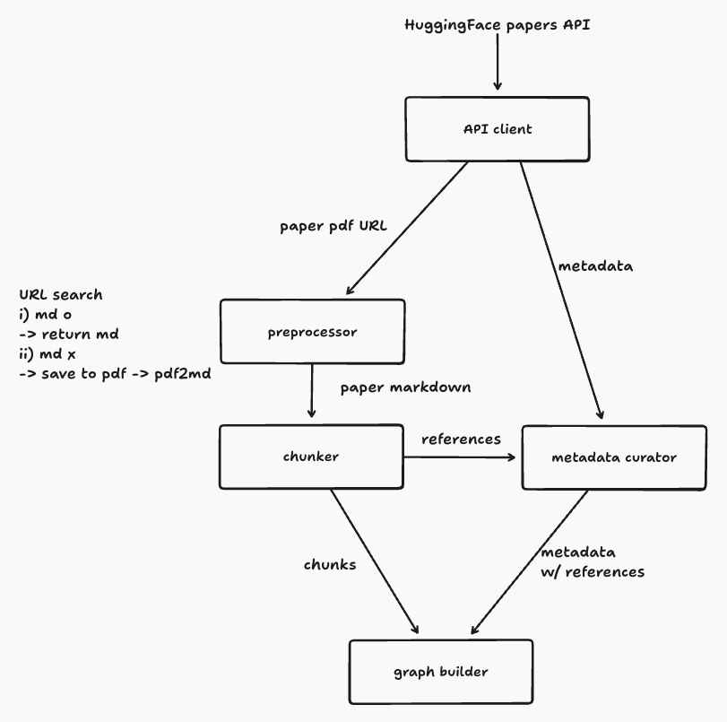

# Indexing

논문 데이터를 수집·전처리하여 지식그래프와 벡터 인덱스를 구축하는 오프라인 데이터 처리 모듈

온라인 백엔드(`backend/`)와 코드·의존성을 공유하지 않는다. 서비스가 떠 있지
않아도 배치를 돌릴 수 있어야 하고, 반대로 이 모듈의 무거운 의존성(PyMuPDF 등)이
API 이미지에 딸려 들어가면 안 되기 때문이다.

```text
indexing/
├── pyproject.toml           # 인덱싱 모듈 전체의 의존성
├── Dockerfile               # 배치 실행 이미지
├── data_pipeline/           # 논문 수집·전처리 (이 문서의 범위)
└── (graph_builder/)         # 지식그래프 구축·임베딩·벡터 인덱싱 — 예정
```

## Data Pipeline

논문 한 편을 처리 단위로, Graph Builder가 쓸 **최종 메타데이터**와 **청크
목록**을 만든다. 그래프 저장, 임베딩 생성, 벡터 인덱싱은 이 모듈의 책임이
아니다.



| 컴포넌트 | 파일 | 책임 |
|---|---|---|
| HF Papers Client | `hf_client.py` | 단건 조회, 특정 날짜 Daily Papers, 기간·월 단위 조회 |
| Preprocessor | `preprocessor.py` | HF Markdown 우선 확보, 실패 시 PDF 다운로드 후 pymupdf4llm 변환 |
| Chunker | `chunker.py` | 섹션 분리 후 청킹, 참고문헌 섹션 원문 분리 |
| Metadata Curator | `metadata_curator.py` | 참고문헌에서 arXiv ID 추출, 최종 메타데이터 완성 |
| Data Pipeline | `pipeline.py` | 조립, 배치 실행, 논문 단위 실패 격리 |

## 실행

```bash
cd indexing
python -m venv .venv && source .venv/bin/activate
pip install -e '.[dev]'

python -m data_pipeline paper 1706.03762            # 논문 한 편
python -m data_pipeline daily --date 2026-08-08     # 특정 날짜 Daily Papers
python -m data_pipeline base --month 2026-08        # 베이스 코퍼스 (해당 월 전체)
```

`--limit N`으로 앞에서 N편만 처리하고, `--json`으로 결과 전체를 표준출력에
쓴다. 테스트는 `pytest`로 실행한다.

중간 산출물(PDF, Markdown)을 파일로 남기는 기능은 없다. PDF는 변환 직후
삭제되는 임시 디렉터리에만 존재한다.

## Docker

서버가 아니라 실행하고 끝나는 Job이다. 하위 명령을 인자로 받는다.

```bash
docker build -t linkpaper-indexing ./indexing

docker run --rm linkpaper-indexing paper 1706.03762
docker run --rm linkpaper-indexing daily --date 2026-08-08
docker run --rm linkpaper-indexing base --month 2026-08 --limit 10
docker run --rm -e INDEXING_CHUNK_SIZE=800 linkpaper-indexing daily
```

인자 없이 실행하면 오늘의 Daily Papers를 처리한다(`CMD ["daily"]`). 백엔드
이미지와 달리 포트를 열지 않고, 외부 PDF를 네이티브 파서로 여는 컨테이너라
non-root(`indexing`)로 실행한다. 임시 PDF는 `/tmp`에만 쓴다.

`docker-compose.yml`에는 넣지 않았다. 배치는 실행 후 종료하므로 compose의
상시 서비스와 수명주기가 다르다. 스케줄러 붙이는 시점에 cron·Job으로
연결하는 편이 맞다.

빌드에 컴파일러가 필요하지 않다(PyMuPDF는 manylinux wheel). 이미지 크기는
약 480MB이며 대부분 PyMuPDF와 onnxruntime이다.

**Tesseract는 넣지 않았다.** 넣으면 이미지가 커지고, OCR로 얻는 것은 대개
그림 안의 글자라 검색 품질에 도움이 되지 않는다. 다만 로컬에 Tesseract가
설치된 환경과 컨테이너의 PDF 변환 결과가 완전히 같지는 않다(같은 논문에서
52청크 대 51청크). `references` 추출 결과는 양쪽 모두 동일했지만,
`content_hash`가 달라지므로 재처리 판단은 같은 환경에서 하는 것이 안전하다.

## Job 인터페이스

주기 실행 스케줄러는 이 모듈에 없다. 외부 Job이 아래를 호출한다.

```python
from data_pipeline import DataPipeline

with DataPipeline() as pipeline:
    # 베이스 구축: 이번 달 전체
    run = pipeline.run_base_corpus()

    # 최신화: 오늘의 Daily Papers
    run = pipeline.run_daily_papers()

    for paper in run.papers:
        graph_builder.upsert(paper.metadata, paper.chunks)  # 두현님 담당
```

두 실행 모드는 조회 범위만 다르고 논문 처리 로직(`process_paper`)은 완전히
같다. 결과를 메모리에 쌓지 않고 흘려보내려면 `process()`가 결과를 하나씩
내보낸다.

```python
for outcome in pipeline.process(papers):
    if outcome.ok:
        graph_builder.upsert(outcome.paper.metadata, outcome.paper.chunks)
    else:
        logger.warning("%s 실패: %s", outcome.paper_id, outcome.error)
```

한 편의 실패는 그 편에서 끝난다. 배치는 계속 진행되고, 실패는
`PipelineRun.failures`에 `paper_id` / `stage` / `error`로 남는다.

## 출력 스키마

`docs/data-architecture/data-retrieval-architecture.md` 4장을 따르되, 이
파이프라인이 실제로 채울 수 있는 필드만 둔다. 채우지 못하는 값을 `None`으로
남기면 Graph Builder가 "값이 없음"과 "아직 안 채움"을 구분할 수 없다.

```python
ProcessedPaper(metadata=PaperMetadata, chunks=list[PaperChunk])
```

반환값은 **Pydantic 모델 객체**이지 JSON 문자열이 아니다. 아래 예시는 형태를
보이려고 `model_dump_json()`을 거친 결과다.

| PaperMetadata | 설명 |
|---|---|
| `paper_id` | HF Papers ID (= arXiv base ID). Markdown 주소와 Chunk ID가 이 값을 쓴다 |
| `arxiv_id` | arXiv 형식일 때만 채운다 |
| `title`, `abstract`, `authors`, `keywords`, `published_at` | Client가 채운다 |
| `source_url`, `pdf_url` | HF 논문 페이지, arXiv PDF |
| `references` | 참고문헌에서 추출한 arXiv ID 목록 (Curator) |
| `content_hash` | 본문 Markdown의 SHA-256 (Curator) |
| `source_version` | `hf-markdown` 또는 `pdf-pymupdf4llm` (Curator) |

| PaperChunk | 설명 |
|---|---|
| `chunk_id` | `<paper_id>:chunk:<index>:<hash8>` (neo4j-schema.md 7.2) |
| `paper_id`, `chunk_index`, `text` | |
| `section`, `section_index` | 청크가 속한 섹션 |
| `is_references` | 참고문헌 섹션에서 나온 청크인지 |
| `char_count`, `content_hash` | |

4.2의 `pageStart` / `pageEnd`는 넣지 않았다. HF Markdown 경로에는 페이지
정보가 없어서 PDF 경로에서만 채워지는 필드가 된다. `tokenCount`도 토크나이저를
정해야 의미가 생기므로 임베딩 담당과 합의한 뒤 추가한다.

### 출력 예시

`python -m data_pipeline paper 1706.03762`의 실제 결과다.

**metadata** — 논문 한 편당 하나. `references`, `content_hash`,
`source_version`이 Metadata Curator가 채운 값이고 나머지는 Client가 채운다.

```json
{
  "paper_id": "1706.03762",
  "arxiv_id": "1706.03762",
  "title": "Attention Is All You Need",
  "abstract": "The dominant sequence transduction models are based on complex recurrent or\nconvolutional neural networks in an encoder-decoder configuration. ... (전문 1,136자)",
  "authors": [
    "Ashish Vaswani",
    "Noam Shazeer",
    "Niki Parmar",
    "Jakob Uszkoreit",
    "Llion Jones",
    "Aidan N. Gomez",
    "Lukasz Kaiser",
    "Illia Polosukhin"
  ],
  "keywords": [
    "recurrent neural networks",
    "encoder-decoder configuration",
    "attention mechanism",
    "Transformer",
    "BLEU score",
    "English constituency parsing"
  ],
  "published_at": "2017-06-12T17:57:34Z",
  "source_url": "https://huggingface.co/papers/1706.03762",
  "pdf_url": "https://arxiv.org/pdf/1706.03762",
  "references": [
    "1308.0850", "1508.04025", "1508.07909", "1511.06114",
    "1601.06733", "1602.02410", "1607.06450", "1608.05859",
    "1609.08144", "1610.02357", "1610.10099", "1701.06538",
    "1703.03130", "1703.10722", "1705.03122", "1705.04304"
  ],
  "content_hash": "c0e87a4bd5ea7663137eda990b1d2bc6a6fe6722ab99bddeb2bee1f6734a6639",
  "source_version": "hf-markdown"
}
```

`abstract`와 `keywords`는 지면 관계로 줄였고, 실제 출력에는 전문과 9개 키워드가
그대로 들어간다. `references`는 16건 전부다.

`published_at`은 타임존이 있는 `datetime`이다. JSON으로 내보내면 위처럼 ISO
문자열이 되고, 객체로 받으면 `datetime` 그대로다.

**chunks** — 위 논문 기준 49개. 그중 하나다.

```json
{
  "chunk_id": "1706.03762:chunk:11:4c89b5f9",
  "paper_id": "1706.03762",
  "chunk_index": 11,
  "text": "We call our particular attention \"Scaled Dot-Product Attention\" (Figure2). The input consists of queries and keys of dimension d k d_{k}, and values of dimension d v d_{v}. ...",
  "section": "3.2.1 Scaled Dot-Product Attention",
  "section_index": 8,
  "is_references": false,
  "char_count": 670,
  "content_hash": "4c89b5f949a095814f82fed91a5a267198957f1e30c0065108956aa427512319"
}
```

참고문헌 섹션에서 나온 청크는 `"is_references": true`, `"section":
"References"`로 나온다. 이 논문에서는 7개다.

수식이 섞인 본문은 위 `text`처럼 LaTeX 조각이 남는다. arXiv HTML을 변환한
결과라 원문에 그렇게 들어 있다. 임베딩 전에 더 다듬을지는 임베딩 담당과
정한다.

### JSON으로 주고받을 때

모든 모델이 Pydantic이라 왕복이 무손실이다. 타임존이 붙은 `datetime`까지 그대로
복원된다.

```python
payload = paper.model_dump_json()                  # 보내는 쪽
paper = ProcessedPaper.model_validate_json(payload)  # 받는 쪽
```

받는 쪽은 `data_pipeline.models`만 import하면 되고 파이프라인 실행
의존성(pymupdf4llm 등)은 필요 없다.

다만 같은 프로세스에서 호출한다면 직렬화하지 않는 편이 낫다. 논문 한 편이
수십~수백 KB라 문자열로 만들었다 되돌리는 비용이 그대로 낭비다.

| 논문 | 청크 | JSON 크기 |
|---|---:|---:|
| Attention Is All You Need | 49 | 53 KB |
| Lingshu | 208 | 225 KB |
| MiniCPM4 | 222 | 244 KB |

metadata만 보면 2.1KB이고 나머지는 대부분 청크 본문이다. 메시지 큐를 끼운다면
편당 크기 한도를 먼저 확인해야 한다. 예를 들어 SQS의 256KB 한도는 논문 한 편이
거의 채운다. 또 한 달치를 배열 하나로 묶으면 수백 MB가 되므로, 논문 한 편을
단위로 JSONL이나 편당 메시지로 흘려보낸다.

## 구현 근거

실제 API·문서 동작을 확인하고 맞춘 부분이다.

**Daily Papers 조회.** `date`는 완전한 ISO 날짜(`YYYY-MM-DD`)만 받는다.
월 단위(`2026-07`)를 넘기면 400이므로 기간 조회는 날짜를 하루씩 돌린다.
페이지네이션은 `p`(0부터)와 `limit`을 쓰고 다음 페이지가 있으면 응답에
`Link: ...; rel="next"` 가 붙는다. 마지막 페이지에도 next가 붙는 경우가 있어
빈 응답에서도 멈춘다.

**Markdown 유효성.** 없는 논문의 `.md` 주소는 404와 함께 HTML 오류 페이지를
돌려준다. 상태 코드만 보면 HTML을 본문으로 착각하므로 content-type과 본문
형태, 최소 길이를 함께 확인한다.

**제목 표기.** 참고문헌 섹션을 찾지 못하면 `references`가 아무 오류 없이 빈
목록이 된다. 실제 입력에서 관찰된 표기가 네 가지라 모두 처리한다.

| 표기 | 출처 |
|---|---|
| `## References` (ATX) | pymupdf4llm |
| `References` + `------` (setext) | HF Markdown의 상위 섹션 |
| `## **References**` (굵게 감싼 제목) | pymupdf4llm |
| 본문 중간의 `**References** [1] ...`, 제목 없는 `References` 줄 | 단 나뉜 PDF, 제목이 없는 논문 |

마지막 두 형태는 제목으로 승격시킨 뒤 처리한다. 앞쪽 목차의 `References`
줄을 실제 목록으로 오인하면 본문 대부분이 참고문헌으로 분류되고 본문의 arXiv
ID가 인용 관계로 둔갑하므로, 문서 후반부의 표기만 인정한다.

`Attention Is All You Need`를 두 경로로 각각 처리하면 HF Markdown 49청크,
PDF 변환 52청크로 양쪽 모두 같은 16건의 references를 추출한다.

**청킹 경계.** 청크는 섹션 경계를 넘지 않는다. 한 청크가 두 섹션에 걸치면
그 청크의 `section` 값이 거짓이 되고 근거 표시도 틀리게 된다.

**참고문헌 원문.** Curator에는 링크를 정리하기 전 원문을 넘긴다. 청크 본문은
`[text](url)` 에서 표시 문자열만 남기는데, 참고문헌에 이 정리를 적용하면
`[논문 제목](https://arxiv.org/abs/...)` 형태의 arXiv ID가 사라진다.

**references 형식.** 추출한 ID는 버전 접미사가 없는 arXiv base ID
(`2401.12345`)로 정규화한다. `paper_id`와 같은 형식이라 Graph Builder가 값을
그대로 맞춰 인용 관계를 만들 수 있다. arXiv ID가 없는 인용(학회 논문, 도서)은
다루지 않는다. 문자열 매칭으로 논문을 추정하면 인용 그래프에 잘못된 간선이
생긴다.

## 설정

환경변수 `INDEXING_*`로 덮어쓴다 (`config.py`).

| 변수 | 기본값 | 용도 |
|---|---|---|
| `INDEXING_HF_PAGE_SIZE` | 50 | Daily Papers 페이지 크기 |
| `INDEXING_HF_MAX_RETRIES` | 3 | 429·5xx·전송 오류 재시도 횟수 |
| `INDEXING_MARKDOWN_MIN_CHARS` | 500 | 이보다 짧으면 PDF로 전환 |
| `INDEXING_CHUNK_SIZE` / `_OVERLAP` | 1200 / 150 | 청크 크기 (문자 수) |
| `INDEXING_LOG_LEVEL` | INFO | |

## 테스트

```bash
pytest
```

외부 API는 `httpx.MockTransport`로, PDF 변환은 주입한 대역 함수로 대체한다.
네트워크와 pymupdf4llm 없이 전체 흐름이 돌아간다. 실제 API 응답에서 관찰한
형태(페이지네이션, 404 HTML, 제목 표기 네 가지)를 그대로 케이스로 넣었다.

## 알려진 한계

- 제목 표기가 하나도 없는 논문은 참고문헌만 분리되고 나머지 본문은
  `Front Matter` 한 섹션에 들어간다. 평문에서 섹션 제목을 추정하는 휴리스틱은
  오탐 위험이 커서 넣지 않았다.
- 수식이 많은 본문에는 청크에 LaTeX 조각이 남는다. 원문(arXiv HTML, PDF)에
  그렇게 들어 있다. 임베딩 품질에 영향이 있다면 임베딩 담당과 정리 범위를
  정한다.
- `--limit`은 처리 편수만 제한한다. 목록 조회는 그대로 수행한다.
- 참고문헌에 arXiv ID가 없는 논문은 `references`가 빈 목록이 된다.

## Graph Builder와 정할 것

| 항목 | 현재 | 정해야 하는 것 |
|---|---|---|
| `paper_id` 접두사 | `1706.03762` | neo4j-schema 7.1은 `arxiv:1706.03762`를 쓴다. 적재 시점에 붙일지, 파이프라인이 낼지 (`chunk_id` 형식도 따라간다) |
| `references` | arXiv base ID 문자열 목록 | 아직 수집 안 된 논문을 `Paper` stub(7.1)으로 만들지, 건너뛸지 |
| `is_references` 청크 | 플래그만 달아 함께 반환 | 임베딩·벡터 인덱스에서 제외할지. 제외가 전제면 파이프라인에서 아예 빼도 된다 |
| `tokenCount`, `pageStart`/`pageEnd` | 없음 | 필요하면 토크나이저를 정한 뒤 추가 |
| 전달 방식 | 객체 (`ProcessedPaper`) | 같은 프로세스면 객체 그대로, 분리하면 JSON |
